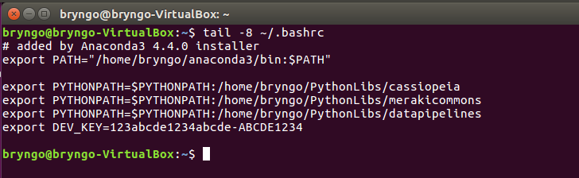
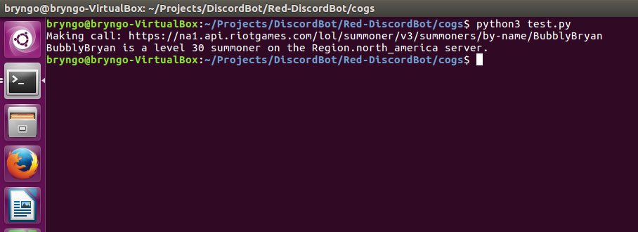

# Cassiopeia Set-Up Guide (From Sources)

1. Install Anaconda. Type the following anywhere in your terminal.
```bash
wget https://repo.continuum.io/archive/Anaconda3-4.4.0-Linux-x86_64.sh
```
2. In the same directory where you just installed the script, run it (if you're not sure whether or not you're in the same directory, type ```ls -l``` and you should see a file named ```Anaconda3-4.4.0-Linux-x86_64.sh```).
```bash
bash Anaconda3-4.4.0-Linux-x86_64.sh
```
3. After the script is done running, verify that the script ran successfully. (Running the following command should output ```Python 3.6.1```. If it isn't type ```source ~/.bashrc``` and verify the version again).
```bash
python --version
```
4. Install the python libraries cassiopeia, merakicommons, and datapipelines.
```bash
mkdir PythonLibs
cd PythonLibs
git clone https://github.com/meraki-analytics/cassiopeia.git
git clone https://github.com/meraki-analytics/merakicommons.git
git clone https://github.com/meraki-analytics/datapipelines.git
```
5. Add the file paths of the 3 libraries to your ```PYTHONPATH``` environment variable.
```bash
echo "export PYTHONPATH=\$PYTHONPATH:$(pwd)/cassiopeia" >> ~/.bashrc
echo "export PYTHONPATH=\$PYTHONPATH:$(pwd)/merakicommons" >> ~/.bashrc
echo "export PYTHONPATH=\$PYTHONPATH:$(pwd)/datapipelines" >> ~/.bashrc
```
6. Add your API key as an environment variable. You get this value from the [Riot Games Developer Portal](https://developer.riotgames.com).
```bash
echo "export RIOT_API_KEY='{insert your dev key here}'" >> ~/.bashrc
```
7. Restart your shell (you can also just close and re-open your terminal).
```bash
source ~/.bashrc
```
8. Verify that all your environment variables were entered sucessfully.
```bash
tail ~/.bashrc
```
Your output for step 9 should look something like this (note that it will not be exactly as in the picture. Your files paths may be different):



9. Do a final test by running a small script. We can do this by cloning this directory and running the python script that's included.
```bash
git clone https://github.com/Sno-House/APISetUp.git
cd APISetUp
python3 test.py
```



10. Congrats! You're done with set up. You now have all the tools to continue making your LoL application. **A couple of important things to note!**
    - API keys seems to currently reset everyday. This means you'll have to manually change your DEV_KEY environment variable everytime you want to work on this. The file you want to change is located here: ```~/.bashrc```. You can use any text editor to open and edit this file. The variables you want to edit are located at the very end of the file.
    - Cassiopeia v3 is still relatively new and the developers are currently fixing bugs. This means that you should frequently update your ```cassiopeia``` library before you start working. To do so, ```cd``` into the cassiopeia directory and type ```git pull``` to sync all the files. To be on the safe side, I would do this for the other two libraries as well (datapipelines and merakicommons)
    
